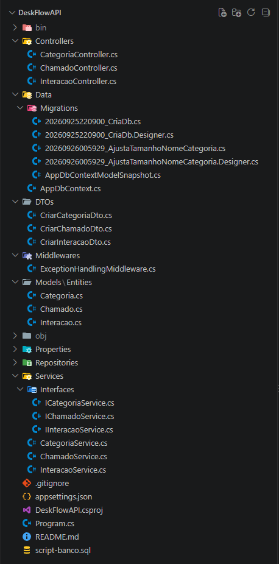

# 🎧 DeskFlow API: Gestão de Chamados e Helpdesk de TI


## 🎯 Sobre o Projeto
A **DeskFlow API** é uma Web API RESTful desenvolvida em **.NET Core 10** utilizando **Entity Framework Core** e **SQL Server**. O sistema automatiza o gerenciamento de chamados de suporte técnico de TI, permitindo a categorização de incidentes, o registro do histórico de interações técnicas e o controle rigoroso do ciclo de vida dos atendimentos.

---

## 🏛️ Arquitetura e Estrutura do Projeto
A aplicação foi desenvolvida seguindo a arquitetura em camadas **Controller -> Service -> Repository**:

- **Controllers:** Responsáveis pela exposição das rotas RESTful, recepção das requisições e retorno dos Status Codes HTTP apropriados (`200`, `201`, `204`, `400`, `404`).
- **Services:** Contêm todas as regras de negócio, validações de integridade e controle de transições de status.
- **Repositories:** Isolam os acessos e operações de leitura/escrita no banco de dados via EF Core.
- **Middlewares:** Captura e tratamento global de exceções não tratadas com respostas JSON padronizadas.

---

## 📁 Estrutura do Projeto


---

## 🧠 Ciclo de Vida do Chamado
O fluxo do atendimento é controlado estritamente pela camada de serviço:

> **[ Aberto ] ──► [ EmAndamento ] ──► [ Fechado ]**

1. **Aberto:** O chamado é registrado pelo solicitante com status `Aberto` e data/hora de abertura gravadas automaticamente.
2. **EmAndamento:** O suporte altera o status para iniciar o atendimento.
3. **Fechado:** O chamado é encerrado mediante a obrigatoriedade do preenchimento da **Solução**. Chamados com status `Fechado` não aceitam novas interações ou alterações.

---

## 📌 Rotas da API (Endpoints)

### 🏷️ Categorias (`/api/categorias`)
| Método | Rota | Descrição |
| :--- | :--- | :--- |
| `POST` | `/api/categorias` | Cadastra uma nova categoria de TI |
| `GET` | `/api/categorias` | Lista todas as categorias cadastradas |
| `GET` | `/api/categorias/{id}` | Busca uma categoria específica pelo ID |
| `PUT` | `/api/categorias/{id}` | Atualiza o nome de uma categoria |
| `DELETE` | `/api/categorias/{id}` | Remove uma categoria (se não houver chamados vinculados) |

### 🎫 Chamados (`/api/chamados`)
| Método | Rota | Descrição |
| :--- | :--- | :--- |
| `POST` | `/api/chamados` | Registra um novo chamado (Status inicial: `Aberto`) |
| `GET` | `/api/chamados` | Lista chamados com filtros dinâmicos por Status, Prioridade ou Categoria |
| `GET` | `/api/chamados/{id}` | Retorna detalhes completos do chamado, incluindo Categoria e Interações |
| `POST` | `/api/chamados/{id}/iniciar` | Transiciona o status do chamado de `Aberto` para `EmAndamento` |
| `POST` | `/api/chamados/{id}/encerrar` | Encerra o chamado informando a Solução (Status final: `Fechado`) |

### 💬 Interações (`/api/chamados/{chamadoId}/interacoes`)
| Método | Rota | Descrição |
| :--- | :--- | :--- |
| `POST` | `/api/chamados/{chamadoId}/interacoes` | Adiciona um comentário/nota técnica ao chamado (se não estiver `Fechado`) |

---

## 🚀 Como Executar a Aplicação

### Pré-requisitos
- [.NET 10 SDK](https://dotnet.microsoft.com/download)
- Instância do **SQL Server** em execução (LocalDB, SQL Express ou Docker)
- Ferramenta EF Core Tools (`dotnet tool install --global dotnet-ef`)

### Passo a Passo

1. **Clonar o repositório:**
   ```bash
   git clone https://github.com/taiserosa/DeskFlowAPI
   cd DeskFlowAPI
   ```

2. **Configurar a Connection String:**
   Abra o arquivo `appsettings.json` na raiz do projeto e ajuste a chave `DefaultConnection` com as credenciais do seu servidor SQL Server:
   ```json
   "ConnectionStrings": 
   {
     "DefaultConnection": "Server=localhost;Database=DeskFlowDb;Trusted_Connection=True;TrustServerCertificate=True;"
   }
   ```

3. **Criação do Banco de Dados:**
   Você pode criar o banco de duas formas:

   - **Opção A (Via EF Core Migrations):**
   ```bash
     dotnet ef database update
   ```
   - **Opção B (Via Script SQL disponível no repositório):**
     Execute o arquivo `script-banco.sql` diretamente no seu SGBD (SQL Server Management Studio ou Azure Data Studio).

4. **Executar a API:**
   ```bash
   dotnet run
   ```

5. **Acessar a documentação no Swagger:**
   Abra o navegador e acesse a URL da aplicação para utilizar as rotas:
   https://localhost:5085/swagger

---

## 🎥 Vídeo de Apresentação
[Vídeo de apresentação da DeskFlow API](https://drive.google.com/file/d/1SNYfguirWGs8Up4VvHx8RrffqjVVJ4EE/view?usp=sharing)

---

## 🛠️ Tecnologias Utilizadas
- **Linguagem / Framework:** C# / .NET Core 10 (Web API)
- **Persistência / ORM:** Entity Framework Core 10
- **Banco de Dados:** Microsoft SQL Server
- **Autenticação:** ASP.NET Core Identity
- **Documentação:** SwaggerUI / OpenAPI
- **Controle de Versão:** Git / GitHub

## Desenvolvido como projeto do Módulo 1 - Desenvolvimento Back-end .NET | Programa SCTEC